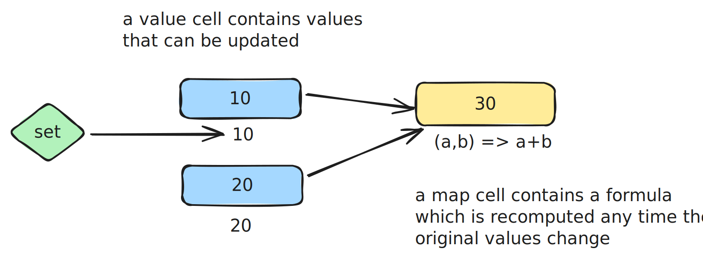

# Cells: A Functional Reactive Programming library

`cells` is a Functional Reactive Programming (FRP) library inspired by spreadsheets. FRP is a programming paradigm that simplifies handling complex, dynamic data flows. It is particularly useful in scenarios with asynchronous data sources, such as user interfaces or real-time data feeds.



`cells` focuses on automation as it transparently manages:

- `async` calls
- undefined values
- errors
- pointers

Although it is a fully independent library, `cells` can be a powerful drop-in replacement for Svelte stores. The build artifacts are currently at 18.7 kB (5.85 kB gzipped).

## Walkthrough

```typescript
import { Sheet } from "@okcontract/cells";

// create a new Sheet, typically one per application
const sheet = new Sheet();

// that's a cell
const cellA = sheet.new(1);

// no need to wait for anything, values and computations will
// be called automatically when they're ready
const cellB = sheet.new(getValueAfterDelay(2, 100));

// that's a _mapped_ cell, that is recomputed automatically when
// either dependent cells are updated
const sum = sheet.map([cellA, cellB], (a, b) => a + b);

// you can map a single cell directly
// and feel free to define mapped cells before their values are available
const prod = cellB.map((v) => 2 * v);

// we await _only_ when we need results
expect(await prod.get()).toBe(4);

// you can update _value_ cells directly (no await)
cellA.set(3);
expect(await sum.get()).toBe(5);

// map computations can be async too
const ok = someCell.map(async (v) => {
  const errors = await validate(v);
  return errors.length === 0;
});
```

Note that:

- `.get()` never returns `undefined` and `cells` semantics waits until cell values are defined. If you need to immediately return a value, use `null` instead.
- At any time, the actual cell value is accessible through `cell.value` (possibly undefined) but it's advisable to avoid relying on a value that could be updated at any moment.

## Subscriptions

You can define subscribers functions to be called whenever a cell value change.

```ts
const cellA = sheet.new(1);

// create subscriptions on any cell
const unsubscribe = cellA.subscribe((v) => {
  console.log({ v });
});

// later call `unsubscribe` to cancel the subscription
unsubscribe();
```

When using `cells` in Svelte files, you can use normally the `$cell` sugar to subscribe to a cell value for display.

Note that unlike Svelte, subscriptions are called in transactional batches, i.e. `cells` wait until all updates are propagated in the `Sheet` to dispatch notifications _once_ to subscribers. This prevents stuttering.

## Memory management and proxies

Cells are not garbage collected automatically, since the best practice is to keep long-running `Sheets` for each application.

To delete a cell, use:

```ts
sheet.delete(cell);
```

To simplify these operations, you can define a sub-graph of cells in a `Proxy` that can be deleted at once.

```ts
import { SheetProxy } from "@okcontract/cells";

// create a proxy (for instance in a Svelte component)
const proxy = new SheetProxy(sheet);

// use the proxy to create new cells...
const cell = proxy.new(1);
// ...and mapped cells
const mappedCell = proxy.map([...cells], (...args)=>{...})

// delete the proxy when you're done
proxy.destroy();
```

There are added benefits of proxies, including a single call to wait for all cells in a `Proxy` to be computed.

```ts
await proxy.wait();
```

## Pointers

Sometimes, you will need to return cells inside `.map` compute functions. `cells` manages this automatically with pointers.

```ts
const cellA = proxy.new(...);
const cellB = proxy.new(...);

// pointerCell will either be cellA or cellB
const pointerCell = proxy.map([cellA, cellB], (a, b) =>
  condition ? cellA : cellB
);

// breathe normally
await pointerCell.get();
pointerCell.map(...);
```

## Cell updates

It's easy to update cells depending on their previous value:

```ts
const counter = proxy.new(0);
// ...
counter.update((prev) => prev + 1);
```

Note that `update` functions should return new arrays and objects, for instance using spread operators `[...prev, new]` and `{...prev, field: new}`.

If you need more complex imperative updates, we suggest you to use `immer`:

```typescript
import { produce } from "immer";

const patch = (prev) => {
  // complex updates...
};
cell.update((prev) => produce(prev, patch));
```

# About

`cells` is built at [OKcontract](https://okcontract.com) and is released under the MIT license.

We aim for ease of use and correction. Chasing down any bug is our top priority.

A non-goal for now is high-performance: `cells` is slower than any direct implementation and should not be used for computationally intensive tasks.

Contributors are welcome, feel free to submit PRs directly for small changes. You can also reach out in our [Discord](https://discord.gg/Cun5aF7k) or contact us on [Twitter](https://x.com/okcontract) in advance for larger contributions.

This work is supported in part by a RFG grant from [Optimism](https://optimism.io).
